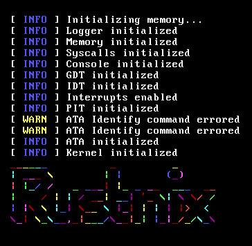

# rustnix
> another useless toy Unix clone

## Features
- [x] Interrupts
- [x] Memory allocation
- [x] ATA disk driver
- [x] Basic inode-based filesystem
- [x] Clock module
- [x] Basic async/await support
- [ ] Syscalls
- [ ] Processes
- [ ] ELF Binaries
- [ ] Basic Userspace

## Thanks
### Code
- for the initial stages of this project, I followed [https://os.phil-opp.com/](https://os.phil-opp.com/)
- the ATA driver code was taken mainly from [https://github.com/vinc/moros](https://github.com/vinc/moros)
### Libraries
- `bit_field`
- `bootloader`
- `chrono`
- `hashbrown`
- `lazy_static`
- `linked_list_allocator`
- `log`
- `pc-keyboard`
- `pic8259`
- `spin`
- `typenum`
- `uart_16550`
- `volatile` (several versions behind)
- `x86_64`
